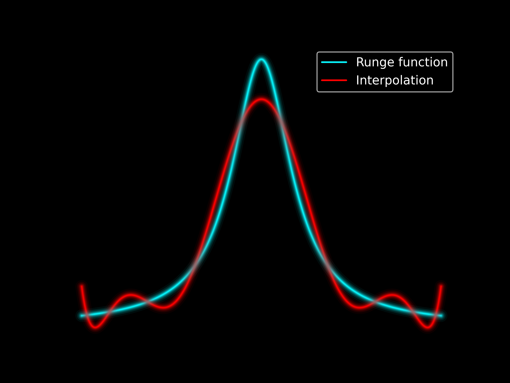

# when-fourier-fails-python
Explore strategies to overcome Gibb's and Runge's phenomenon when handling discontinuous and non-periodic data on uniform grids. 
The different notebooks implement:
- Arbitrary-order finite difference stencils
- Filters
- Mollifiers (Boyd's imbricate bell Fourier extension of the second kind or the Local Fourier Basis (LFB) method)
- Subtraction methods (Polynomial and trigonometric subtraction)
- Inverse Polynomial Reconstruction (IPR)
- SVD extensions (Boyd's Fourier extension of the third kind)
- Gram-Fourier extension (Gram-FE) (see the 'tables' folder for some pre-computed extensions and the corresponding notebook for their computation and usage)

Please look at the linked blog post for a more structure introduction.

